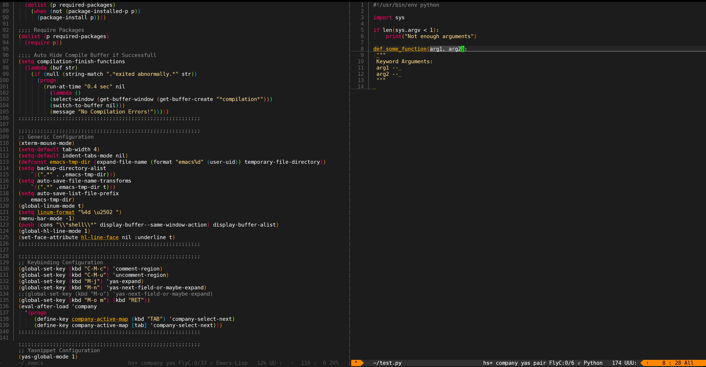

[](https://travis-ci.org/lillypad/emacs.d)
[](https://ci.appveyor.com/project/lillypad/emacs-d)
[](https://github.com/lillypad/emacs-lillypad/blob/master/LICENSE)
[](https://github.com/lillypad/emacs-lillypad/)
[](https://github.com/lillypad/emacs-lillypad/)
[]()
[]()
[](https://github.com/lillypad/emacs.d/issues)

# lillypad's emacs.d

:sparkles: An Emacs Configuration for Humans :sparkles:

# Table of Contents
- [`Quick Installation`](#quick-installation)
- [`Screenshots`](#screenshots)
- [`Features`](#features)
- [`Supported Languages`](#supported-languages)
- [`Dependencies`](#dependencies)
- [`Manual Installation`](#manual-installation)
- [`Keybindings`](#keybindings)
- [`Feature Requests`](#feature-requests)
- [`Contributing`](#contributing)
- [`Special Thanks`](#special-thanks)

# Quick Installation

Run this one command and you are done! :stuck_out_tongue_winking_eye:

```bash
curl -s https://raw.githubusercontent.com/lillypad/emacs.d/master/setup.sh | bash
```

If you are using `WinBlows` you have to use the `ps1` script instead:

```powershell
Set-ExecutionPolicy Bypass -Scope Process -Force; iex ((New-Object System.Net.WebClient).DownloadString('https://raw.githubusercontent.com/lillypad/emacs.d/master/setup.ps1'))
```

# Screenshots


# Features
- Package Load Optimization
- Autocompletion
- Syntax Checking
- Snippets
- Rainbow Delimiters
- Powerline
- Magit
- Spell Check
- Git Diff
- Slime
- Alchemist
- Web Mode
- Tern
- Emmet
- NeoTree
- Paredit
- Ivy
- Ace Jump

# Supported Languages:
- Lisp
- Clojure
- Rust
- PHP
- ActionScript
- Suricata IDS/IPS
- Snort IDS/IPS
- Yara
- Powershell
- Elixir
- Golang
- C with Clang
- C++ with Clang
- Python
- Javascript
- JSON
- Markdown
- Ruby
- HTML
- CSS
- Dockerfile

# Dependencies
- [`python`](https://www.python.org/)
- [`npm`](https://www.npmjs.com/)
- [`nodejs`](https://nodejs.org/en/)
- [`clang`](https://clang.llvm.org/get_started.html)
- [`git`](https://git-scm.com/documentation)
- [`pip`](https://pip.pypa.io/en/stable/)

# Manual Installation

__Ubuntu:__
```bash
git clone https://github.com/lillypad/emacs.d.git
cd ~/.emacs.d/
make ubuntu
```

__Debian:__
```bash
git clone https://github.com/lillypad/emacs.d.git
cd ~/.emacs.d/
make debian
```

__Arch:__
```bash
git clone https://github.com/lillypad/emacs.d.git
cd ~/.emacs.d/
make arch
```

__Gentoo:__
```bash
git clone https://github.com/lillypad/emacs.d.git
cd ~/.emacs.d/
make gentoo
```

__Mac OSX:__
```bash
git clone https://github.com/lillypad/emacs.d.git
cd ~/.emacs.d/
make osx
```

__Windows:__
```powershell
Set-ExecutionPolicy Bypass -Scope Process -Force; iex ((New-Object System.Net.WebClient).DownloadString('https://chocolatey.org/install.ps1'))
choco upgrade chocolatey
choco install -y git make
cmd /s /k cd %APPDATA%
git clone https://github.com/lillypad/emacs.d.git .emacs.d
cd .emacs.d
make windows
```

__Setup:__
```bash
make install
```

__Testing:__
```bash
make test
```

# Keybindings
- <kbd>CTRL</kbd>+<kbd>C</kbd> Copy
- <kbd>CTRL</kbd>+<kbd>X</kbd> Cut
- <kbd>CTRL</kbd>+<kbd>V</kbd> Paste
- <kbd>ALT</kbd>+<kbd>C</kbd> Comment Region
- <kbd>ALT</kbd>+<kbd>U</kbd> Uncomment Region
- <kbd>ALT</kbd>+<kbd>J</kbd> Expand Snippet
- <kbd>ALT</kbd>+<kbd>N</kbd> Next Snippet
- <kbd>CTRL</kbd>+<kbd>X</kbd> <kbd>G</kbd> Open Magit
- <kbd>CTRL</kbd>+<kbd>X</kbd> <kbd>P</kbd> Open Package Manager
- <kbd>CTRL</kbd>+<kbd>X</kbd> <kbd>T</kbd> Open EShell
- <kbd>CTRL></kbd>+<kbd>X</kbd> <kbd>F</kbd> Open/Close NeoTree
- <kbd>CTRL</kbd>+<kbd>ALT</kbd>+<kbd>S</kbd> Spell Checking
- <kbd>CTRL</kbd>+<kbd>ALT</kbd>+<kbd>D</kbd> Git Diff
- <kbd>TAB</kbd> Completion Cycle Next
- <kbd>SHIFT</kbd>+<kbd>TAB</kbd> Completion Cycle Previous
- <kbd>CTRL</kbd>+<kbd>J</kbd> Expand Emmet
- <kbd>CTRL</kbd>+<kbd>ALT</kbd>+<kbd>X</kbd> <kbd>S</kbd> Start Emacs Server

# Feature Requests:
Add a feature request under issues and I may be able to add it in.

# Contributing
I will accept pull requests after reviewing them.

# Special Thanks
- [oblivia-simplex](https://github.com/oblivia-simplex)
  - Converted me from Vim to Emacs
- [BobuSumisu](https://github.com/BobuSumisu)
  - Creator of `snort-mode` (I've added a few improvements)
- [jmdeldin](https://github.com/jmdeldin)
  - Made port of `ir-black-theme` (Modified to make `anarchy-theme`)

If you like this project buy me a drink :wine_glass:
